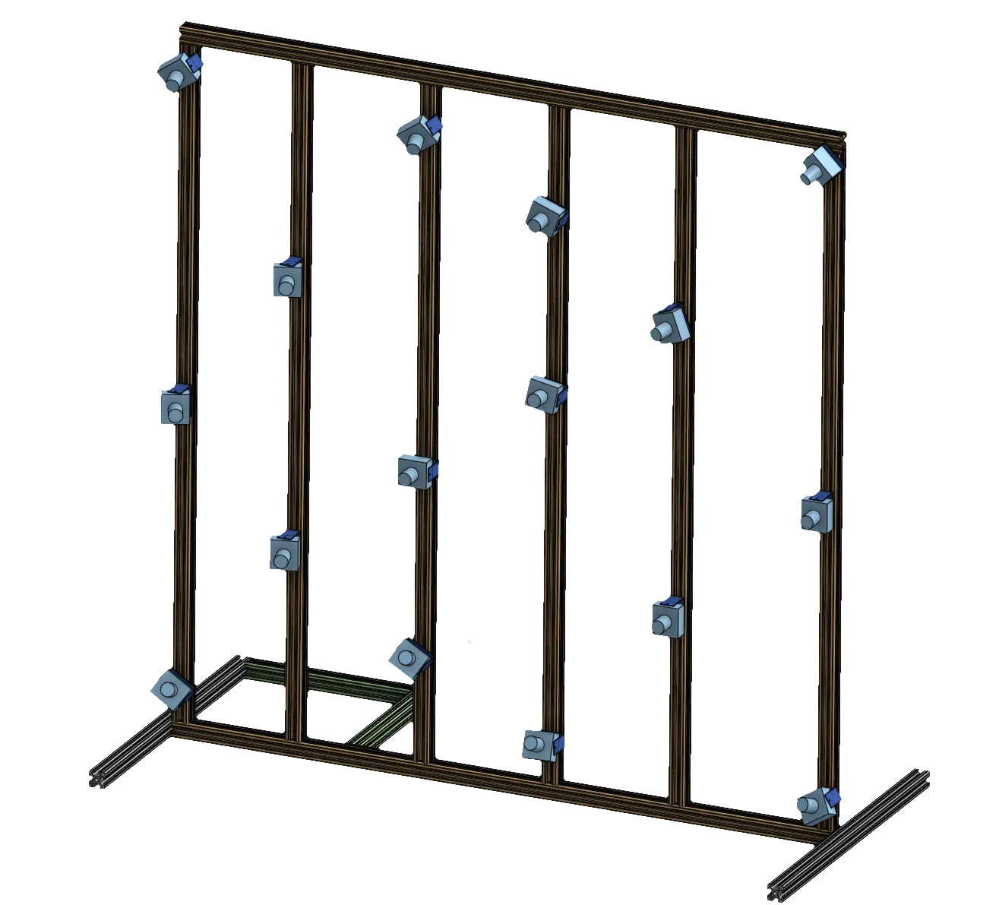

# bevy_light_field 💡🌾📷

rust bevy light field camera array tooling

## run the viewer

`cargo run -- --help`

the viewer opens a window and displays the light field camera array, with post-process options

## capabilities

- [ ] grid view of light field camera array
- [ ] person segmentation post-process (batch across streams)
- [ ] camera array calibration
- [ ] 3d reconstruction dataset preparation
- [ ] real-time 3d reconstruction viewer

## light field camera array

view the [onshape model](https://cad.onshape.com/documents/20d4b522e97cda88fb785536/w/9939c2cecd85477ae7e753f6/e/69f97c604cdee8494e4e46bc?renderMode=0&uiState=65ea51d493f7bd0c772084fa)

- [ ] parts list

## setup rtsp streaming server

it is useful to test the light field viewer with emulated camera streams

### obs studio

- install https://obsproject.com/
- install rtsp plugin https://github.com/iamscottxu/obs-rtspserver/releases
- Tools > RTSP Server > Start Server

## compatible bevy versions

| `bevy_light_field`    | `bevy` |
| :--                   | :--    |
| `0.1.0`               | `0.13` |
